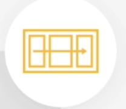
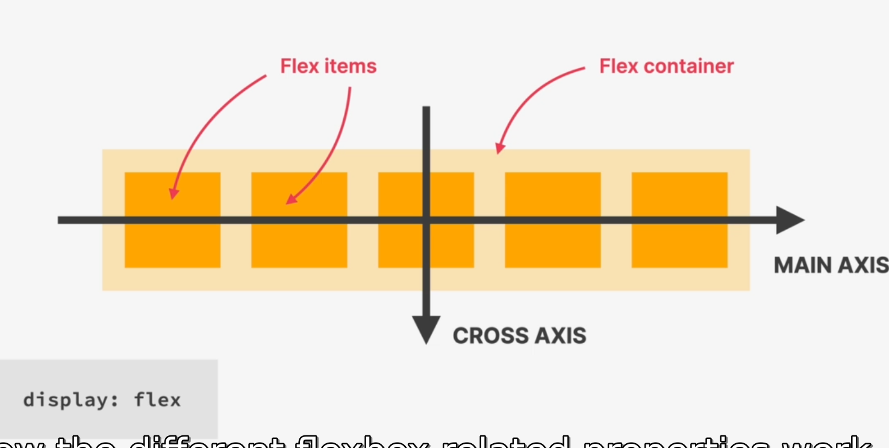
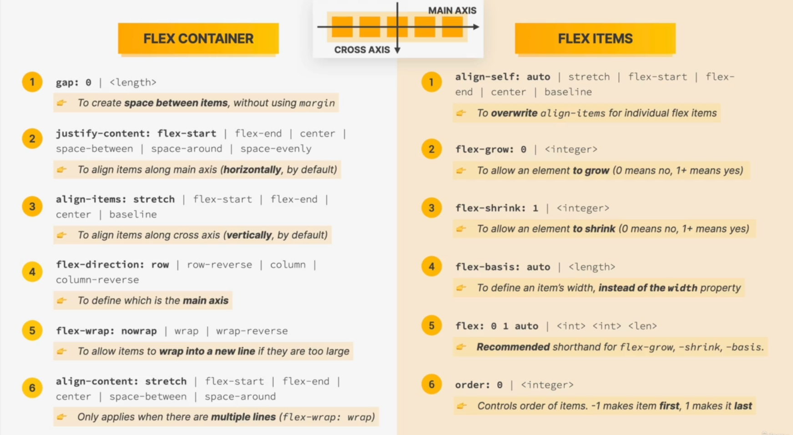
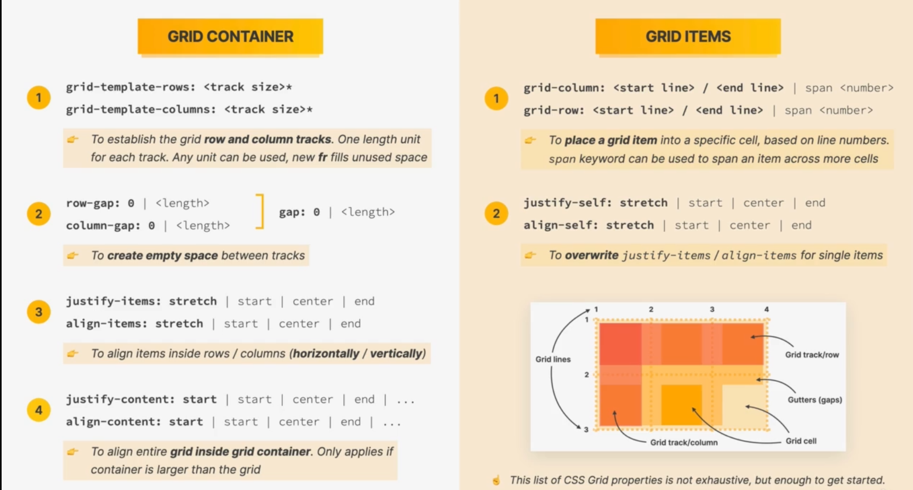
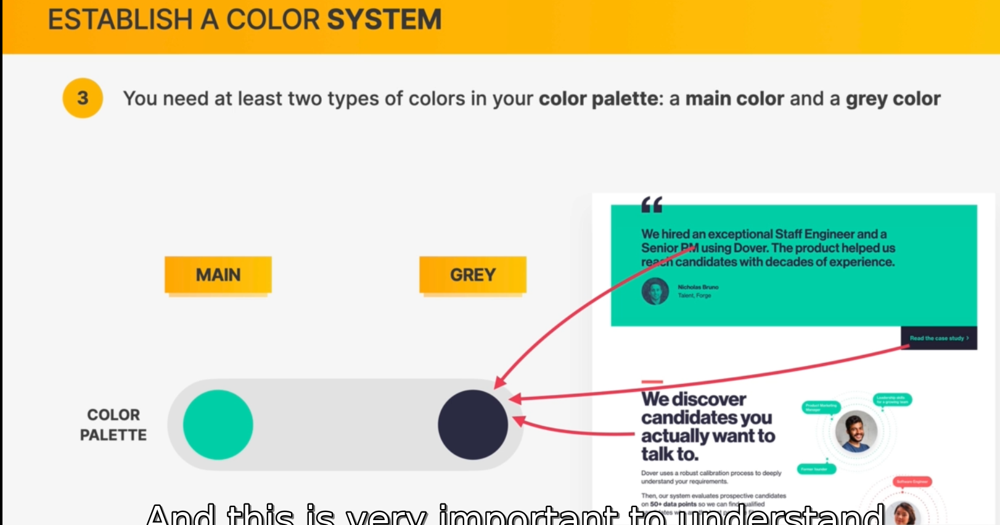
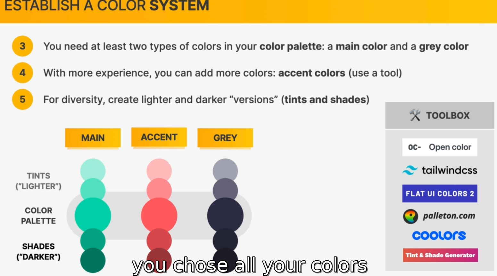
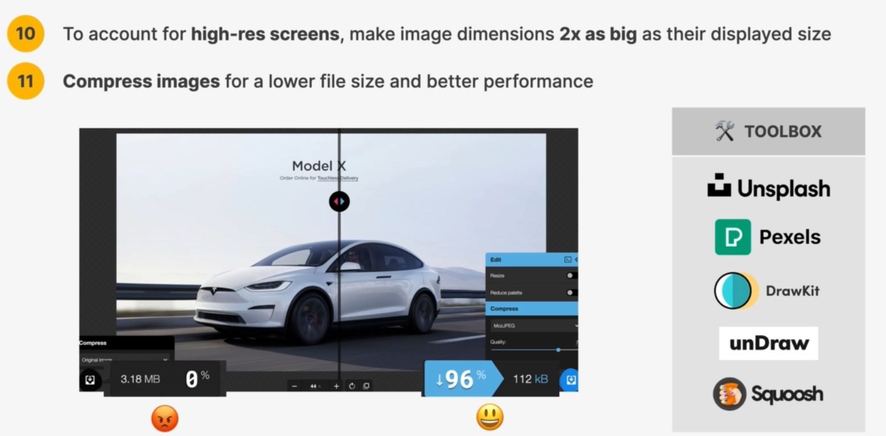

### Boxes css

1. Inline Boxes
    - that element occupies all the space

    - occupies only the space necessary for its content

    - causes no line-breaks after or before the element

    - Box model applies in a different way: heights and widths do not appy

    - Paddings and margins are applied only horizontally (left to right)

    - css display: inline (change block to inline)

2. Block level boxes
    - Elements are formatted visually as blocks

    - Elements occupy 100% of parent element's width no matter the content

    - Elements are stacked vertically by default, one after another

    - The box-model applies as showed earlier

    - default elements: body, main, header, footer, section, nac, aside, div, h1-h6, p, ul, ol, li, etc

    - css display:block (change inline to block)

3. Inline-block boxes
    - Looks like inline from the outside, behaves like block level on the inside

    - Occupies only content's space
    - Causes no line break
    - Box-model applies as showed
    - css display: inline-block

### Normal flow vs absolute positioning
Normal flow
- Default positioning
- Elements is in flow
- Elements are simply laid out according to their order in the html code
Default positioning
position: relative

Absolute Positioning
- Element is removed from normal flow: "out of flow"
- No impact on surrounding elements, might overlap them
- We use top, bottom, left, or right to offset the element from its relatively positioned container
position: absolute

### Layout 
Layout is 
1. Layout is the way text , images and other content is placed and arranged on a webpage
2. Layout gives the page a visual structure, into which we place our content
3. Build alayout: arranging page elements into a visual structure, instead of simply having them placed one after another(normal flow)

there are two types of layout

### page layout vs component layout
1. the 3 ways of building layouts with css
    - Float layouts
        - The old way ofo building layouts of al sizes, using the float css property, Still used, but gettubg iytdated fast
    - Flexbox
        - Modern way of laying out elements in a 1 dimensional row without using floats. perfect of component layouts
    - Css grid
        - For laying out element in a fully-fledged 2-dimensional grid. perfect for page layouts and complex components

Float
    - Elemennt is removed from the normal flow
    - Text and inline elements will wrap around the floated element
    - the container will not adjust its height to the element

Flex box
    - Flexbox is a set of related css properties for building 1-demensional layouts
    - The main idea behind flexbox is that empty space inside a container element cam be automatically divided by its child elements
    - Flexbox makes it easy to automatically align items to one another inside a parent container, both horizontally and vertically
    - Flexbox solves comon problems such as vertoca; centering and creating equal-height columns
    - Flexbox is perfect for replacing floats, allowing us to write fewer and cleaner HTML and CSS code
.

### CSS GRID
- CSS Grid is a set of CSS properties for building 2-demensional layouts
- The main idea behind CSS Grib is that we divide a container element into rows and columns that can be filled with its child elements
- In two-demensional contexts, CSS Grod allows us to write less nested HTML and easier to read CSS
- CSS grid is not meant to replace flexbox! instead, they work perfectly together. Need a 1D layout? use flexbox, Need a 2d layout? Use css grid

## Web Design Rules
### Some concepts first
### Typography
- Typography is the art and technique of arranging type to make written languege legible, readable and appealing when displayed (Đánh chữ là nghệ thuật và kỹ thuật sắp xếp các ký tự để khi hiển thị, văn bản trở nên dễ đọc, trực quan và thu hút mắt.)

- serif vs sans-serif
    - serif creates a traditional/classic look and feel (Tạo ra vẻ đẹp truyền thống/cổ điển)
    - conveys trustworthiness (Truyền tải được sự đáng tin cậy)
    - good for long text

    - Sans-serif modern look and feed
    - Clean and simple
    - Easier to choose for beginner designer

1. Use only good and popular typefaces and play it safe
6 font size very popular (Sans-serif)
inter, open sans, roboto, montserrat, work sans, lato
6 font size very popular (serif)
merriweather, aleo, Playfair Display, cormarant, cardo, lora

2. It's okay to use just one typeface per page! If you want more, limit to 2 typeface

3. Choose the right typeface according to your website personality:

    - Choose the tight personality for your website (more on this later)
    - Decide between a serif and sans-serif typeface
    - Experiment with all the good typefaces (and other typesfaces from google fonts!) to see thich ones best fits your website's message (this will come with experience)
    - You can keep trying different typefaces as you design and build the page

4. Use good font sizes and weights
When choosing font-sizes, limit choices! use a type scanle tool or other pre-defined ranger

5. Use a font size between 16px and 32px for normal text

6. For long text (like a blog post), try a size of 20px or even bigger

7. For headlines, you can go really big (50px+) and bold (600px+), depending on personality

8. For any text, don't use a font weight under 400(regular)

9. Use less than 75 characters per line

10. For normal-sized text, use a line height between 1.5 and 2. for big text, go below 1.5
  - The smaller or longer the text, the larger the line height needs to be(Khi văn bản ngắn hoặc dài hơn, khoảng cách giữa các dòng (line height) cần phải lớn hơn.)

11. Decrease letter spacing in headlines, if it looks unnatural(this will come from experience)

12. Experiment with all caps for short titles, Make them small and bold and increase letter-spacing

13. Usually, don't justify text

14. Don't center long text blocks. small blocks are fine

### Choose the right color
1. Make the main color match your website's personality: colors convey meaning
    - Red draws a lot of attention, and symbolizes power, passion, and excitement
    - Orange is less aggressive, and conveys happiness, passion, and excitement
    - Yellow means joy, brightness, and intelligence
    - Greens represents harmony , nature, growth, and health
    - 
2. Use a good color tone! Don't choose a random tone or css named colors.(tools: open color, tailwindcss, flat ui colors 2)

3. You need at least two types of colors in your color palette: amin color and a grey color

4. With more experience, you can add more colors: accent(secondary) colors (use a tool)
5. For deversity, create lighter(tints) and darker(shades) 'version' (tints and shades)

6. Use your main color to draw attention to the most important elements on the page
7. Use colors to add interesting accents or make entire components or sections stand out
8. You can try to use your color strategically in images and illustrations
9. On dark colored backgrounds, try to use a tint of the background(lighter version) for text
10. Text should usually not be completely black. Lighten if up it looks heavy and uninviting
11. Don't make text too light! Use a tool to check contrast between text and background color(use some tools like a coolors)
    - Contrast ratio needs to be at least 4.5:1 for normal text and 3:1 for large text (18px+)

### Images and illustrations
1. Differenct types of images: Product photos, storytelling, illustrations, patterns
2. Use images to support your website's message and story. So only use relevant images!
3. Prefer original images. if not possible, use original-looking stock images(not generic ones)
4. try to show real people to trigger user's emotions
5. if necessary, crop images to fit your message
6. experiment combining photos, illustrations and patterns
#### handing text on images
1. Darker or brighten image(completely or partially, using gradient)
2. Position text into neutral image area
3. Put text on box
4. To account for high-res screens, make image dimensions 2x as big as their displayed size
    Scale factor: Actual pixels the screen contains/ Pixels represented on screen
    On high-res screens, scale factor is 2x or even 3x, on "normal" screens it's just 1x (1 physical pixel = 1 design pixel)
5. Compress images for a lower file size and better performance

6. When using multiple images side by side, make sure they have the exact same dimensions

### Icons
1. Use a good icon pack, there are tons of free and paid icons packs
2. Use onle one icon pack. Don't mix icons from different icon packs
3. Use SVG icons or icon fonts. Don't use bitmap image formats(jpg, png)
4. Adjust to website personality! Roundness, weight and filled/outlined depend on typography
5. Use icons to provide visual assistance to text
6. Use icons for product feature blocks
7. Use icons associated with actions, and label them (unless on space or icon is 100% clear)
8. Use icons as bullet points
9. To keep icons neutral, use same color as text. To draw more attention, use different color
10. Dont confy your users: icons need to make sense and fit the text or action
11. Don't make icons larger than what theu were designed for. if needed, enclose them in a shape

### Shadows
- After an era of 100% flat design, we're now back to using shadows in UI design (flat design 2.0)
- Shadow creates depth (3d): the mỏe shadow, the further away from the interface the element is(shadow can be used on boxes and text)

1. You don't have to use shadows! Only use them if  it makes sense for the website personality
2. Use shadows in small doses: don't add shadows to every element
3. Go light on shadows, don't make them too dark
4. Use small shadows for smaller  elements that should stand out(to draw attention)
5. Use medium-size shadows for larger areas that should stand out a bit  more
6. Use large shadows for elements that should really float above the interface
7. Experiment with changing shadows on mouse interaction (click and hover)
8. Bonus: experiment with glows(colored shadows)